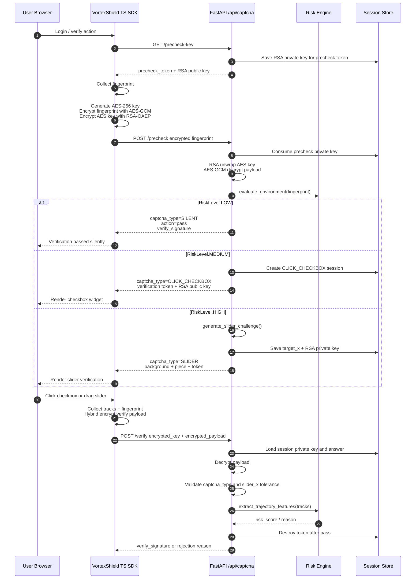

# VortexShield (涡流之盾)

> 下一代 AI 驱动的无感行为风控验证码系统。以 Turnstile 式低打扰体验、混合密码学链路和生物动力学轨迹判定，为登录、支付、注册、内容发布等高风险入口提供可进化的人机对抗防线。


## Overview

VortexShield 是一个完整的智能行为验证码与风控验证系统。它不把“验证码”理解为一张图，而是把客户端环境、交互轨迹、加密通信、安全校验编排、样本沉淀和模型训练连接成一条闭环安全链路。

系统默认优先执行静默预检：可信环境直接签发短时效安全凭证；存在弱信号时升级为轻量复选框；高风险环境进入滑块拼合校验。每一次验证都会生成可训练的轨迹样本，为后续 AI 风控模型持续进化提供数据飞轮。

## Features

- **无感多态安全校验编排**
  Cloudflare Turnstile 级交互策略，支持 `SILENT` / `CLICK_CHECKBOX` / `SLIDER` 三态自适应切换。低风险用户无感通过，高风险请求才触发增强校验，最大限度降低正常用户摩擦。

- **重装甲通信链路**
  前后端采用 `RSA-OAEP-2048 + AES-GCM-256` 混合加密。浏览器本地生成 AES 会话密钥，RSA 公钥只用于密钥封装，Payload 使用认证加密保护点击、拖拽轨迹与指纹数据，降低中间人篡改与重放风险。

- **生物动力学风控引擎**
  基于一阶速度、二阶加速度、速度标准差、加速度方差、瞬时速度峰值等轨迹特征识别脚本拖拽、匀速直线、坐标瞬移和机器代滑行为。

- **滑块图像合成引擎**
  后端使用 Pillow 动态合成带噪点与干扰线的滑块背景，随机生成方形、星形、月亮形拼图缺口，并记录服务端真实 `target_x` 用于精度校验。

- **数据飞轮与 AI 进化**
  内置异步 JSONL 轨迹日志沉淀，提供 `RandomForestClassifier` 训练脚本，自动完成特征工程、样本不足时的 Synthetic Data 兜底、特征重要性分析与模型序列化。

- **现代化工程基建**
  原生 TypeScript 单文件 SDK、状态机式 UI 管理、i18n 自动适配、FastAPI 模块化后端、Docker Compose 部署、红蓝对抗自动化攻击脚本一应俱全。

## Architecture



## Project Structure

```text
VortexShield (涡流之盾)/
├── app/
│   ├── api/routes/captcha.py          # precheck / verification / verify API
│   ├── core/config.py                 # 全局配置，如滑块容差和 TTL
│   ├── core/enums.py                  # CaptchaType / RiskLevel
│   ├── schemas/captcha.py             # Pydantic API 数据结构
│   └── services/
│       ├── captcha_generator.py       # 滑块验证码图像合成
│       ├── crypto.py                  # RSA-OAEP + AES-GCM 解密
│       ├── data_logger.py             # 异步轨迹 JSONL 数据飞轮
│       ├── risk_engine.py             # 环境探针与轨迹统计风控
│       ├── site_registry.py           # siteKey / secret 站点注册表
│       └── session_store.py           # Mock Session Store
├── frontend/
│   ├── src/vsec-sdk.ts                # 原生 TypeScript SDK
│   ├── dist/vsec-sdk.js               # 浏览器可直接加载的 SDK
├── demo/login.html                    # 真实业务登录页仿真
├── logs/trajectory_data.jsonl         # 轨迹样本沉淀
├── models/vsec_rf_model.pkl           # 随机森林风控模型
├── scripts/train_risk_model.py        # AI 风控训练管道
├── tests/simulate_attack.py           # 红蓝对抗攻击脚本
├── Dockerfile
└── docker-compose.yml
```

## Quick Start

### 1. Install Dependencies

```powershell
cd "D:\code\VortexShield (涡流之盾)"
python -m venv .venv
.\.venv\Scripts\python.exe -m pip install --upgrade pip
.\.venv\Scripts\python.exe -m pip install -r requirements.txt
```

### 2. Start Backend API

```powershell
.\.venv\Scripts\python.exe -m uvicorn app.main:app --reload --host 127.0.0.1 --port 48921
```

或使用项目脚本：

```powershell
.\run_server.ps1
```

Health check:

```text
http://127.0.0.1:48921/health
```

API docs:

```text
http://127.0.0.1:48921/docs
```

Product home:

```text
http://127.0.0.1:48921/home
```

API console:

```text
http://127.0.0.1:48921/home/api
```

本地演示后台令牌为 `vsec_admin_demo`。生产部署请设置环境变量 `VSEC_ADMIN_TOKEN`
为高强度随机值，否则不要开放 `/home/api` 到公网。

### 3. Open Business Login Demo

```powershell
.\run_frontend.ps1
```

访问：

```text
http://127.0.0.1:48923/demo/login.html
```

也可以手动启动静态服务：

```powershell
.\.venv\Scripts\python.exe -m http.server 48923 --bind 127.0.0.1 --directory .
```

访问：

```text
http://127.0.0.1:48923/demo/login.html
```

### 4. Integrate Like Turnstile

先进入 `/home/api` 创建业务站点 API，拿到公开 `siteKey` 和私有 `secret`。
没有后台创建的 `siteKey`，即使前端加载 SDK，也会收到 `invalid_site_key`，无法使用 VortexShield。

前端只需要在业务站点自托管 `frontend/dist/vsec-sdk.js`，并配置公开 `siteKey`：

```html
<div id="vsec-captcha"></div>
<script src="/vsec-sdk.js"></script>
<script>
  const captcha = new window.CaptchaSDK({
    container: "#vsec-captcha",
    apiBaseUrl: "https://vsec.pawn.eu.org",
    siteKey: "vsec_site_demo",
    action: "login",
    onSuccess(signature) {
      document.querySelector("#vsec_signature").value = signature;
    },
  });
  captcha.execute();
</script>
```

业务后端拿到表单里的 `verify_signature` 后，使用私有 `secret` 调用 `/api/siteverify`：

```bash
curl -X POST https://vsec.pawn.eu.org/api/siteverify \
  -H "Content-Type: application/json" \
  -d '{"secret":"vsec_secret_demo","response":"vsig_xxx","action":"login","hostname":"localhost"}'
```

演示凭据仅用于本地和上线探针：

```text
siteKey = vsec_site_demo
secret  = vsec_secret_demo
```

## API Surface

| Method | Endpoint | Purpose |
| --- | --- | --- |
| `GET` | `/api/captcha/precheck-key` | 下发预检 RSA 公钥与短时效 precheck token |
| `POST` | `/api/captcha/precheck` | 静默环境风控，返回 `SILENT` / `CLICK_CHECKBOX` / `SLIDER` |
| `GET` | `/api/captcha/challenge` | 显式创建滑块拼合校验流程，主要用于调试和高风险升级 |
| `POST` | `/api/captcha/verify` | 解密 Payload，校验滑块精度与轨迹风险，签发 `verify_signature` |
| `POST` | `/api/siteverify` | 业务后端使用私有 `secret` 校验并一次性消费 `verify_signature` |
| `GET` | `/home` | VortexShield 产品首页 |
| `GET` | `/home/api` | API 创建与站点管理后台 |
| `GET` | `/home/api/sites` | 列出已配置站点 API |
| `POST` | `/home/api/sites` | 创建站点 API，返回一次性展示的私有 `secret` |
| `GET` | `/health` | 服务健康检查 |

## Docker Deployment

生产容器使用 `python:3.11-slim`，Uvicorn 绑定 `0.0.0.0:48921`。当前版本的验证码 Session/RSA 私钥仍在进程内存中，默认使用单 worker 保证 precheck -> verify 链路稳定；横向扩展前请先切换 Redis Session Store。

```powershell
docker compose up -d --build
```

查看状态：

```powershell
docker compose ps
docker compose logs -f vsec-api
```

停止服务：

```powershell
docker compose down
```

可选 Redis 预留：

```powershell
docker compose --profile redis up -d
```

当前版本的验证码会话默认使用内存 Mock Session Store；生产多副本部署时建议切换为 Redis / Redis Cluster / DynamoDB 等集中式会话存储。控制台创建的站点 API 会持久化到 `data/site_registry.json`，Docker Compose 已挂载 `./data:/app/data`，避免服务重启后接入凭证丢失。

## Red Team Simulation

VortexShield 提供 Playwright 攻击仿真脚本，用于验证环境探针、匀速检测、瞬移检测与 UI 拒绝反馈。

安装浏览器自动化依赖：

```powershell
.\.venv\Scripts\python.exe -m pip install playwright
.\.venv\Scripts\python.exe -m playwright install chromium
```

运行匀速直线拖动攻击：

```powershell
.\.venv\Scripts\python.exe tests\simulate_attack.py --mode uniform_drag --slow-mo 20
```

运行 JS 瞬移篡改攻击：

```powershell
.\.venv\Scripts\python.exe tests\simulate_attack.py --mode js_teleport --slow-mo 20
```

预期终端输出：

```text
[+] 成功触发防护机制：探测到绝对匀速直线运动，验证被拒绝！
```

## AI Model Training

轨迹样本会异步写入：

```text
logs/trajectory_data.jsonl
```

训练随机森林风控模型：

```powershell
.\.venv\Scripts\python.exe scripts\train_risk_model.py
```

模型输出：

```text
models/vsec_rf_model.pkl
```

训练脚本会自动完成：

- JSONL 日志读取与坏行容错
- 样本过少时 Synthetic Data 兜底
- 轨迹高维特征提取
- `RandomForestClassifier` 训练
- Accuracy / Classification Report 输出
- Feature Importances 排名
- `joblib` 模型序列化

未来接入在线推理时，可在 `risk_engine.py` 中加载 `models/vsec_rf_model.pkl`，复用同等特征工程逻辑，将 `predict_proba(...)[1]` 作为 Bot 概率，与当前硬规则共同构成“规则 + 模型”的双层风控决策。

## Security Notes

- Captcha token 校验通过后立即销毁，降低重放窗口。
- AES-GCM 提供机密性与完整性认证，Payload 被篡改会解密失败。
- RSA 私钥只保存在服务端 Session Store 中，客户端只接触公钥。
- 滑块拼合校验不仅校验 `slider_x` 精度，还继续校验拖拽轨迹，防御图像识别后接口代滑。
- JSONL 数据飞轮已做基础指纹脱敏，生产环境仍建议接入数据分级、访问审计和保留周期策略。

## Testing

```powershell
.\.venv\Scripts\python.exe -m pytest
```

## License

Recommended license: MIT. If you publish this repository as open source, add a `LICENSE` file at the project root before release.
